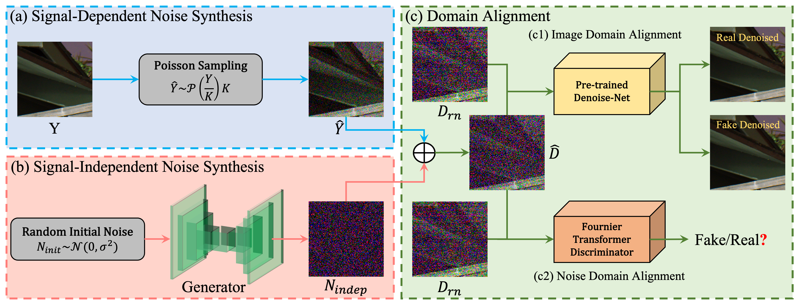

# Towards General Low-Light Raw Noise Synthesis and Modeling (ICCV 2023)
**Technical Report**: <a href='https://openaccess.thecvf.com/content/ICCV2023/html/Zhang_Towards_General_Low-Light_Raw_Noise_Synthesis_and_Modeling_ICCV_2023_paper.html'></a>


LRD is a general framework for low-light raw noise synthesis and modeling.
Specifically, we synthesize the signal-dependent and signal-independent noise in a physics- and learning-based manner, respectively. In this way, our method can be considered as a general model, that is, it can simultaneously learn different noise characteristics for different ISO levels and generalize to various sensors.

## :snake:Synthesis Pipeline


## :open_file_folder:LRD Dataset
The LRD dataset is available for download at [Baidudisk](https://pan.baidu.com/s/1m7Qwa4Y2IvpAlCfmlgWiUQ) (vj53) or [Dropbox](https://www.dropbox.com/scl/fi/tari9hvf2ubxo232owekz/LRD.zip?rlkey=7zj9kqgsf06g97smexkrzv05q&dl=0) or [One Drive](https://1drv.ms/u/s!Ag-MqgbV0Z6NjH3TLuQEF_QszXrR?e=3ugcxy)


## :heavy_check_mark:Pretrained Models
The pretrained models for raw denoise is available at [Baidudisk](https://pan.baidu.com/s/1iMNrQh5P4g2prhhk2Tcu_g) (ujzm) or [Google Drive](https://drive.google.com/file/d/1VkgHyEU6hNsXLL1vRfFWWLZCmGYGyi_h/view?usp=sharing).

Due to the business license, pre-trained models for noise synthesis are not available now.

## :bookmark_tabs:Intallation
Download the ELD dataset and SID dataset at the following links:

ELD ([official project](https://github.com/Vandermode/ELD)): [download (11.46 GB)](https://drive.google.com/file/d/13Ge6-FY9RMPrvGiPvw7O4KS3LNfUXqEX/view?usp=sharing)  
SID ([official project](https://github.com/cchen156/Learning-to-See-in-the-Dark)):  [download (25 GB)](https://storage.googleapis.com/isl-datasets/SID/Sony.zip)

* Install the conda environment
```
conda create -n lrd python=3.8
conda activate lrd
```
* Install Pytorch
```commandline
conda install pytorch==1.9 torchvision cudatoolkit=10.2 -c pytorch
```
* Install Packages for Raw Image
```commandline
pip install ExifRead
pip install h5py
```

**Note that the rawpy version is using ELD's customized rawpy, which can be downloaded from https://github.com/Vandermode/ELD.**

* Install other packages
```commandline
pip install tqdm
pip install lmdb
pip install glob
pip install imageio
pip install PyYAML
pip install timm
pip install patchify
conda install -c conda-forge scipy
pip install opencv-python
pip install tensorboardx
pip install scikit-image
pip install colour
pip install pylab-sdk
pip install pillow
```

## :car:Run
* Quick start to raw denoising tests for SID dataset
```commandline
python test_denoise_SID.py
```
* Quick start to raw denoising tests for ELD dataset
```commandline
python test_denoise_ELD.py
```
* Quick start to raw denoising tests for LRD dataset
```commandline
python test_denoise_LRD.py
```

Due to the business license, the source code for noise synthesis is not available now.

## :book: Citation
If you find our LRD model useful for you, please consider citing :mega:
```bibtex
@InProceedings{Zhang_2023_ICCV,
    author    = {Zhang, Feng and Xu, Bin and Li, Zhiqiang and Liu, Xinran and Lu, Qingbo and Gao, Changxin and Sang, Nong},
    title     = {Towards General Low-Light Raw Noise Synthesis and Modeling},
    booktitle = {Proceedings of the IEEE/CVF International Conference on Computer Vision (ICCV)},
    month     = {October},
    year      = {2023},
    pages     = {10820-10830}
}
```

## :email:Contact
If you have any question, feel free to email fengzhangaia@hust.edu.cn.
